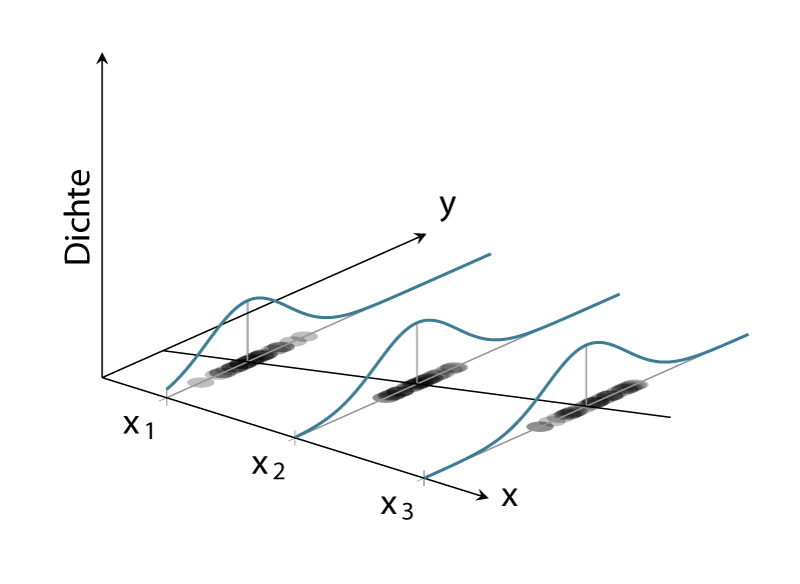

# Grundlagen und Inferenz 

```{r}
#| echo: false
#| warning: false
#| message: false
source('_common.R')
```

## Back to school

Wir beginnen mit einem uns schon bekannten Konzept, der Punkt-Steigungsform aus der Schule (siehe @eq-slm-psform-1).

$$
y = m x + b
$$ {#eq-slm-psform-1}

Wir haben eine abhängige Variable $y$ und eine lineare Formel $mx + b$ die den funktionalen Zusammenhang zwischen den Variablen $y$ und $x$ beschreibt. Um dies konkret zu machen seien die folgenden Festsetzungen gegeben: $m = 2$ und $b = 3$. Die @eq-slm-psform-1 wird dann zu:

```{r}
m <- 2
b <- 3
```

$$
y = `r m` x + `r b`
$$ {#eq-slm-psform-2}

Um ein paar Werte für $y$ zu erhalten, setzen wir jetzt verschiedene Werte für $x$ ein, indem wir $x$ in Einserschritten zwischen $[0, \ldots, 5]$ erhöhen. Um die Werte darzustellen, verwenden wir zunächst eine Tabelle (vgl. @tbl-slm-psform):

```{r}
#| tbl-cap: "Tabelle der Daten"
#| label: tbl-slm-psform

tib_psf <- tibble(x = 0:5, y = m * x + b)
kable(tib_psf,
      booktabs = T,
      linesep = '')

```

Wenig überraschend nimmt $y$ für den Wert $x = 0$ den Wert $`r b`$ an und z. B. für den Wert $x = 3$ nimmt $y$ den Wert $`r m` \cdot 3 + `r b` = `r m*3+b`$ an.  

Eine weitere Darstellungsform ist die graphische Darstellung, indem wir die Werte von $y$ gegen $x$ in einem Graphen abtragen (siehe @fig-slm-psform-1).

```{r}
#| fig-cap: "Graphische Darstellung der Daten aus @tbl-slm-psform"
#| label: fig-slm-psform-1

ggplot(tib_psf, aes(x,y)) +
  geom_line() + 
  geom_point(size=4)

```

Wiederum wenig überraschend sehen wir einen linearen Zuwachs der $y$-Werte mit den größer werdenden $x$-Werten. Da in der Definition der Formel @eq-slm-psform-2 nirgends festgelegt wurde, dass diese nur für ganzzahlige $x$-Werte gilt, haben wir direkt eine Gerade durch die Punkte gelegt. Somit sollte auch die Bedeutung von $m$ und $b$ direkt klar sein. Die Variable $m$ bestimmt die Steigung der Gleichung, während $b$ den y-Achsenabschnitt beschreibt.  

::: {#def-slm-basics-y-intercept}
## $y$-Achsenabschnitt

Der y-Achsenabschnitt\index{y-Achsenabschnitt} ist der Wert, den $y$ einnimmt, wenn $x$ den Wert $0$ annimmt. Sei $y$ durch eine lineare Gleichung $y = mx + b$ definiert, dann wird der y-Achsenabschnitt durch den Wert $b$ bestimmt.
:::

Die Variable $m$ hingegen bestimmt die Steigung der Geraden.  

::: {#def-slm-basics-slope}
## Steigungskoeffizient

Wenn $y$ durch eine lineare Gleichung $y = mx + b$ definiert ist, dann bestimmt die Variable $m$ die Steigung der dazugehörenden Geraden. D. h., wenn sich die Variable $x$ um eine Einheit vergrößert (verkleinert), wird der Wert von $y$ um $m$ Einheiten größer (kleiner). Gilt $m < 0$, dann umgekehrt.\index{Steigungskoeffizient}
:::

Diese beiden trivialen Konzepte mit eigenen Definitionen zu versehen, erscheint im ersten Moment vielleicht etwas übertrieben. Wie sich allerdings später zeigen wird, sind diese beiden Einsichten immer wieder zentral, wenn es um die Interpretation von linearen statistischen Modellen geht.  

Soweit so gut. Führen wir direkt ein paar Symbole ein, die uns später noch behilflich sein werden. Sei jetzt die Menge der $x$-Werte gegeben $x = [0, 1, 2, 3, 4, 5]$. Streng genommen handelt es sich wieder um ein Tupel, da wir jetzt die Reihenfolge nicht mehr ändern. Wir führen nun einen Index $i$ ein, um einzelne Werte in dem Tupel über ihre Position zu bestimmen, und wir hängen diesen Index $i$ an $x$ an. Dann wird aus $x$, $x_i$.

```{r}
#| tbl-cap: "$x$-Werte und ihr Index $i$"
#| label: tbl-slm-basic-index

kable(tibble(i = 1:6, x = 0:5),
      booktabs = T,
      linesep = '',
      col.names = c('Index $i$', '$x$-Wert'))
```

Damit können wir jetzt einen speziellen Wert, zum Beispiel den dritten Wert, mit $x_3 = 2$ bestimmen. Wenden wir unseren Index auf unsere Formel \eqref{eq-slm-psform-1} an, folgt daraus, dass $y$ jetzt auch einen Index $i$ erhält.

$$
y_i = m x_i + b \qquad i \text{ in } [1,2,3,4,5,6]
$$

Wir bezeichnen die beiden Variablen $m$, die Steigung, und $b$, den y-Achsenabschnitt, mit neuen Variablen, die ebenfalls einen Index erhalten. Aus $m$ wird $\beta_1$ und aus $b$ wird $\beta_0$. Damit wird der y-Achsenabschnitt mit $\beta_0$ bezeichnet und die Steigung wird mit $\beta_1$ bezeichnet. Dann wird aus unserer Gleichung:  

$$
y_i = \beta_0 + \beta_1 x_i
$$ {#eq-slm-psform-beta}

Formel \eqref{eq-slm-psform-beta} ist immer noch die einfache Punkt-Steigungsform. Es wurde lediglich der Index $i$ eingeführt, um unterschiedliche $x-y$-Wertepaare zu identifizieren. Weiterhin wurde der $y$-Achsenabschnitt und die Steigung mit neuen Symbolen versehen. Wenn im späteren Verlauf des Skripts die die multiple linearen Regression eingeführt wird, hat diese Nomenklatur große Vorteile, da nicht mehr nur eine einzige $x$-Variable vorhanden ist sondern mehrere. Hier vereinfacht die Benutzung von $\beta$s die Schreibweise, da zusätzliche $\beta$s nach Bedarf angehängt werden können und mit einem fortlaufenden Index (z. B. $\beta_2, \beta_3, \ldots$) versehen werden können.

Bezogen auf die Datenpunkte, nochmal jeder Datenpunkt besteht aus zwei Koordinaten, einem $x$-Wert und einem $y$-Wert. Um die Datenpunkte voneinander auseinander zu halten verwenden wir den Index $i$ (siehe @fig-slm-basic-index-2). 

```{r}
#| fig-cap: "$x-y$-Werte und ihr Index $i$"
#| label: fig-slm-basic-index-2

ggplot(tib_psf, aes(x,y)) +
  geom_point(size=4) +
  geom_text(aes(label = paste0('(x[', x+1, ']~y[', x+1, '])')),
             parse=T, nudge_x=.35)
```

## Funktionaler versus stochastischer Zusammenhang zwischen zwei Variablen

Bei dem bisherigen Zusammenhang handelt es sich um einen funktionalen Zusammenhang\index{Funktionaler Zusammenhang} zwischen den beiden Variablen $x$ und $y$. Funktional deswegen, weil wir ein definiertes mathematisches Modell angeben können, d. h., wir haben eine präzise mathematische Funktion, welche die Beziehung zwischen den beiden Variablen beschreibt. Wenn wir den Wert für $x$ kennen, dann können wir einen einzigen Wert für $y$ ausrechnen, indem wir den Wert $x$ in @eq-slm-psform-1 einsetzen. Aus der Schule kennen wir noch die Darstellung $y = f(x)$. Streng genommen ist diese Darstellung für Formel @eq-slm-psform-1 nicht ausreichend, denn um den Wert für $y$ auszurechnen, benötigen wir auch noch Kenntnis über die Werte $m$ und $b$, bzw. in unserer weiteren Darstellung $\beta_0$ und $\beta_1$. Daher sollte der Zusammenhang eigentlich mit $y = f(x, \beta_0, \beta_1)$ bezeichnet werden. Es gilt aber immer noch: Für gegebene $x, \beta_0$ und $\beta_1$ ist der Wert für $y$ fest determiniert.

Wenn wir mit realen Daten arbeiten, funktioniert dieser Ansatz leider nicht direkt. Selbst wenn wir ein Experiment mehrmals genau gleich durchführen, werden wir immer etwas unterschiedliche Werte im Sinne der Messungenauigkeit messen. Wenn wir biologische Systeme messen, kommt hinzu, dass diese in den seltensten Fällen zeitstabil sind, sondern immer bestimmte Veränderungen von einem Zeitpunkt zum nächsten auftauchen.

In @fig-slm-basics-jump-1 ist ein realer Datensatz abgetragen. Auf der $y$-Achse sind die Sprungweiten von mehreren Weitspringerinnen gegen die Anlaufgeschwindigkeit auf der $x$-Achse abgetragen. Bei der Betrachtung der Daten erscheint ein linearer Zusammenhang zwischen diesen beiden Variablen durchaus plausibel.

```{r defs_reg_01}
jump <- readr::read_delim('data/running_jump.csv',
                          delim=';',
                          col_types = 'dd')  
jump <- jump |> add_column(i = 1:dim(jump)[1], .before=1)
mod_jump <- lm(jump_m ~ v_ms, jump)
jump <- jump |> mutate(y_hat = predict(mod_jump))
```

```{r}
#| fig-cap: "Zusammenhang der Anlaufgeschwindigkeit und der Sprungweite beim Weitsprung"
#| fig-height: 4
#| label: fig-slm-basics-jump-1 

id_mark <- which(jump$v_ms > 9 & jump$v_ms < 9.1)[-2]
ggplot(jump, aes(v_ms, jump_m)) +
  geom_point(data = jump[id_mark,], color = 'red', size = 3) +
  geom_point(size=2) + 
  labs(x = 'Anlaufgeschwindigkeit[m/s]',
       y = 'Sprungweite[m]') 
```

In @fig-slm-basics-jump-1 sind zwei Punkte rot markiert. Die beiden Werte haben praktisch den gleichen $x$-Wert, unterscheiden sich allerdings bezüglich ihrer $y$-Werte deutlich voneinander. Und dies sind nicht die einzigen Beispielpaare, bei denen die $x$-Werte nahe zusammenliegen, während die $y$-Werte klar voneinander getrennt sind. Dies steht im Unterschied zu einem funktionalen Zusammenhang nach @eq-slm-psform-1. Bei einem rein funktionalen Zusammenhang wird jedem $x$-Wert genau ein $y$-Wert zugeordnet.

Die Abweichungen kommen durch zufällige Einflussfaktoren wie eben die Veränderungen angesprochener biologischer Faktoren und Messunsicherheiten. Beim Beispiel des Weitsprungs spielen auch noch externe Einflüsse, wie beispielsweise Windverhältnisse, eine Rolle. Vielleicht hatte der Springer beim zweiten Mal auch keine Lust mehr. Wenn die Punkte zwei unterschiedliche Springer darstellen, kommt hinzu, dass zwei Weitspringer bei identischer Anlaufgeschwindigkeit unterschiedliche Sprungfähigkeiten haben oder auch technisch nicht gleich gesprungen sind, und so weiter. Insgesamt führen all diese Einflüsse dazu, dass wir nicht mehr einen streng funktionalen Zusammenhang zwischen unseren beiden Variablen $x$ (der Anlaufgeschwindigkeit) und $y$ (der Sprungweite) vorfinden. Es handelt sich um einen **stochastischen Zusammenhang** zwischen den beiden Variablen. Wie wir mit diesen zufälligen Einflüssen umgehen, ist das zentrale Thema des nächsten Abschnitts und markiert auch unseren Einstieg in die einfache lineare Regression.

## Die einfache lineare Regression

Bleiben wir bei unserem Beispiel aus @fig-slm-basics-jump-1. Wir versetzen uns in die Lage einer Weitsprungtrainerin, die vor der Aufgabe steht, ihr Training zu optimieren, um die Weitsprungleistung ihrer Athleten zu verbessern. Wir haben uns dazu entschlossen, am Anlauf etwas zu verbessern, wissen jetzt aber nicht, ob das wirklich lohnenswert ist. Von einer befreundeten Trainerin haben wir einen Datensatz mit Anlaufgeschwindigkeiten und den dazugehörigen Sprungweiten erhalten. Schauen wir uns zunächst einmal die Struktur der Daten an.

```{r}
#| label: tbl-slm-basics-jump-1
#| tbl-cap: "Ausschnitt der Sprungdaten"

jump |> select(jump_m, v_ms) |> 
  head(n = 7) |>  
  kable(booktabs=TRUE,
               linesep="",
               digits = 2)
```

In @tbl-slm-basics-jump-1 sind die ersten $7$ Zeilen der Sprungdaten abgebildet. Die Daten zeigen eine einfache Struktur mit zwei Spalten. `jump_m` bezeichnet die Sprungweiten und `v_ms` die Anlaufgeschwindigkeiten. Damit wir die Datenpaare voneinander unterscheiden bzw. identifizieren können, führen wir unseren bereits besprochenen Index $i$ ein und können so einzelne Paare ansprechen.

```{r}
#| label: tbl-slm-basics-jump-2
#| tbl-cap: "Ausschnitt der Sprungdaten"
jump |> select(i, jump_m, v_ms) |>
  head(n = 7) |>  
  kable(booktabs=TRUE,
               linesep="",
               digits = 2)
```

Daher hat zum Beispiel der dritte Datenpunkt $i = 3$ die Datenwerte $\text{jump}_3 = `r round(jump[["jump_m"]][2],2)`$ und $\text{v}_3 = `r round(jump[["v_ms"]][3],2)`$.

Das waren bisher aber nur Formalitäten. Wir wollen jetzt den Zusammenhang zwischen den beiden Variablen modellieren. Wir könnten wahrscheinlich auch einfach Pi-mal-Daumen abschätzen, wie groß der Zusammenhang ist. Wenn wir jetzt aber einen unserer Läufer haben, der z.B. etwa $9m/s$ anläuft, welchen Vergleichswert nehmen wir dann aus @fig-slm-basics-jump-1? Den unteren oder den oberen der beiden roten Werte? Oder vielleicht den Mittelwert? Welchen Wert nehmen wir, wenn unser Athlet mit $v=9.7m/s$ anläuft? Da haben wir leider keinen Vergleichswert in unserer Tabelle. Daher wäre es schon ganz praktisch, eine Formel nach dem Muster von @eq-slm-psform-beta zu haben. Wie wir allerdings schon festgestellt haben, geht dies nicht so einfach, da wir eben das Problem mit den Einflussfaktoren haben, die dazu führen, dass die Werte nicht präzise auf einer Geraden liegen. Somit liegt die Herausforderung nun darin, eine Gerade zu finden, die möglichst *genau* die Daten widerspiegelt.


```{r}
#| fig-cap: "Mögliche Geraden, um den Zusammenhang der Anlaufgeschwindigkeit und der Sprungweite zu modellieren"
#| label: fig-slm-basics-line-1

beta_0 <- coef(mod_jump)[1]
beta_1 <- coef(mod_jump)[2]
ggplot(jump, aes(v_ms, jump_m)) + 
  geom_abline(slope = beta_1, intercept = beta_0, col = 'blue', alpha=.3)  +
  geom_abline(data = tibble(s = beta_1 + seq(-0.1, 0.1, 0.2), y_in = beta_0),
              aes(slope = s, intercept = y_in), alpha=.1, col='blue') +
  geom_abline(intercept = 3, slope = 0.3, col = 'blue', alpha=.3) +
  geom_abline(intercept = -3, slope = 1.2, col = 'blue', alpha=.3) +
																	 
							  
  geom_point() +
										
  labs(x = 'Anlaufgeschwindigkeit[m/s]',
       y = 'Sprungweite[m]') 
```

In @fig-slm-basics-line-1 sind die Daten zusammen mit verschiedenen möglichen Geraden abgebildet. Eine kurze Überlegung macht schnell klar, dass es im Prinzip unendlich viele unterschiedliche Geraden gibt, die durch die Datenpunkte gelegt werden können. Da jede Gerade durch die beiden Parameter $\beta_0$ und $\beta_1$ spezifiziert ist, gibt es somit auch unendlich viele Kombinationen von $\beta_0$ und $\beta_1$, die die jeweiligen Geraden definieren. Um nun eine spezielle Gerade aus den unendlich vielen Geraden auswählen zu können, benötigen wir ein Kriterium, das definiert, was eine besser passende versus eine schlechter passende Gerade durch die gegebenen Punkte ist. Das heißt, wir suchen eine Gerade, die im Sinne eines Kriteriums *optimal* ist. Tatsächlich gibt es verschiedene Möglichkeiten, Kriterien zu entwickeln. Das am weitesten verbreitete und auch intuitiv nachvollziehbare Kriterium basiert auf den quadrierten Abweichungen der Geraden von den Datenpunkten (engl. **least squares**). Versuchen wir daher nun, die Herleitung der least squares schrittweise nachzuvollziehen.

## Methode der kleinsten Quadrate

Fangen wir dazu zunächst einmal mit den einfachen Abweichungen an, also nicht den quadrierten Abweichungen. In @fig-slm-basics-line-2 ist zur Übersicht nur ein Ausschnitt der Daten zusammen mit einer möglichen Geraden eingezeichnet. Die senkrechten Abweichungen der Geraden zu den jeweiligen Datenpunkten sind rot eingezeichnet. Es ist ersichtlich, dass für diese Wahl der Geraden zwei Punkte ziemlich genau auf der Geraden liegen, während die anderen Punkte oberhalb bzw. unterhalb der Geraden liegen. Ein mögliches Kriterium könnte dementsprechend sein, diejenige Gerade aus den unendlich vielen zu finden, bei der die Abweichungen (die roten Linien) ein Minimum annehmen.

```{r}
#| fig-cap: "Abweichungen der Gerade von den Datenpunkten für die Daten mit einer Anlaufgeschwindigkeit zwischen $8m/s$ und $10m/s$."
#| label: fig-slm-basics-line-2

beta_0 <- coef(mod_jump)[1]
beta_1 <- coef(mod_jump)[2]
ggplot(jump |> filter(v_ms > 8, v_ms < 10), aes(v_ms, jump_m)) + 
  geom_abline(slope = beta_1, intercept = beta_0, col = 'blue', alpha=.3)  +
  geom_segment(aes(x = v_ms, xend = v_ms, yend = jump_m, y = y_hat),
               col = 'red') +
  geom_point(size=3) +
  labs(x = 'Anlaufgeschwindigkeit[m/s]',
       y = 'Sprungweite[m]') 
```

Um die Abweichungen (rote Linien) berechnen zu können, benötigen wir für jeden beobachteten Wert den dazugehörigen Punkt auf der Geraden. Wenn wir die Gerade schon hätten, wäre das kein Problem. Bisher haben wir allerdings nur die Formel der Geraden. Die Punkte auf der Geraden sind mithilfe der Formel genau diejenigen $y$-Werte, die für die jeweiligen $x$-Werte mittels $\beta_0 + \beta_1 x_i$ berechnet werden. Die Abweichung für einen Punkt $y_i$ von der Geraden lässt sich somit wie folgt berechnen:

$$
\text{Abweichung}_i = y_i - (\beta_0 + \beta_1 x_i)
$$

Entsprechend führt unser Kriterium, die Summation der Abweichungen über alle Punkte, zu folgender Formel:

$$
\text{min}\sum_{i=1}^n y_i - (\beta_0 + \beta_1 x_i) = \sum_{i=1}^n y_i - \beta_0 - \beta_1 x_i
$$

Wir verschärfen das Kriterium, um eine optimale Gerade zu finden, indem wir größere Abweichungen stärker gewichten wollen als kleinere. Das heißt, große Abweichungen zwischen der Geraden und den Datenpunkten sollen stärker berücksichtigt werden als kleine Abweichungen. Dies können wir erreichen, indem wir die Abweichungen quadrieren. Dementsprechend erhalten wir die folgende Gleichung:

$$
E(\beta_0, \beta_1) = \sum_{i=1}^n(y_i - (\beta_0 + \beta_1 x_i))^2
$$ {#eq-slm-basics-rms-1}

Mit $E(\beta_0, \beta_1)$ wird ausgedrückt, dass die Summe von der Wahl der beiden Parameter $\beta_0$ und $\beta_1$ abhängt. $E$ ist eine Funktion von $\beta_0$ und $\beta_1$. Um unsere Gerade zu bestimmen, suchen wir daher das Minimum der Funktion $E(\beta_0, \beta_1)$ ($E$ steht hier für "error").

Die Abweichungen der Punkte auf der Geraden von den tatsächlichen Datenpunkten spielen in der weiteren Betrachtung immer wieder eine wichtige Rolle und haben daher einen eigenen Term. Die Abweichungen werden als Residuen $e_i$ bezeichnet. Dementsprechend kann die Minimierungsgleichung auch so dargestellt werden:

$$
\text{min} \sum_{i=1}^n e_i^2
$$
																			  
Es gilt $e_i := y_i - (\beta_0 + \beta_1 x_i)$. Insgesamt lassen sich die folgenden, sogenannten Normalengleichungen herleiten, um die Koeffizienten zu bestimmen:

$$
\begin{aligned}
\hat{\beta_1} &= \frac{\sum_{i=1}^n (x_i - \bar{x})(y_i - \bar{y})}{\sum_{i=1}^n (x_i - \bar{x})^2} \\
\hat{\beta_0} &= \bar{y} - \hat{\beta_1} \bar{x} 
\end{aligned} 
$$ {#eq-slm-basics-norm} 

$\bar{x}$ und $\bar{y}$ sind die Mittelwerte von $x_i$ und $y_i$. Diese beiden Gleichungen werden als die Normalengleichungen\index{Normalengleichungen} bezeichnet.

Wir führen noch einen weiteren Term ein: den vorhergesagten Wert $\hat{y}_i$ von $y_i$ anhand der Geradengleichung. Das Hütchen über $y_i$ zeigt an, dass es sich um einen geschätzten Wert handelt. Wenn wir $\beta_0$ und $\beta_1$ anhand der Normalengleichungen bestimmen, dann sind das mit großer Wahrscheinlichkeit nicht die *wahren* Werte aus der Population, sondern wir haben sie nur anhand der Daten geschätzt. Daher bekommen die berechneten Werte ebenfalls ein Hütchen $\hat{\beta}_0$ und $\hat{\beta}_1$. Insgesamt nimmt die lineare Geradengleichung dann folgende Form an:

$$
\hat{y}_i = \hat{\beta}_0 + \hat{\beta}_1 \cdot x_i
$$

D.h. die Residuen können auch mittels $e_i = y_i - \hat{y}_i$ dargestellt werden. Graphisch sind die $\hat{y}_i$s die Werte auf der Geraden für die gegebenen $x_i$-Werte.

```{r}
#| fig-cap: "Die vorhergesaten Werte $\\hat{y}_i$ auf der Gerade."
#| label: fig-slm-basics-line-3

beta_0 <- coef(mod_jump)[1]
beta_1 <- coef(mod_jump)[2]
ggplot(jump |> filter(v_ms > 8, v_ms < 10), aes(v_ms, jump_m)) + 
  geom_abline(slope = beta_1, intercept = beta_0, col = 'blue', alpha=.3)  +
  geom_segment(aes(x = v_ms, xend = v_ms, yend = jump_m, y = y_hat),
               col = 'red') +
  geom_point(size=3) +
  geom_point(aes(y = y_hat), color = 'yellow', size=3) +
  labs(x = 'Anlaufgeschwindigkeit[m/s]',
       y = 'Sprungweite[m]') 
```

Gehen wir zurück zu unseren Weitsprungdaten. Wenn wir die Datenpunkte in die Normalengleichungen @eq-slm-basics-norm einsetzen, dann erhalten wir für die Koeffizienten die Werte $\hat{\beta}_0 = -0.14$ und $\hat{\beta}_1 = 0.76$. Somit folgt für die Geradengleichung:

$$
\hat{y}_i = -0.14 + 0.76 \cdot x_i
$$

Wir erhalten die graphische Darstellung der Geradengleichung indem die $x_i$-Werte eingesetzt werden und eine Gerade durch die Punkte gezogen wird. Oder auch einfacher für den größten und den kleinsten $x_i$-Wert.

```{r}
#| fig-cap: "Die Regressionsgerade der Sprungdaten."
#| label: fig-slm-basics-line-4

beta_0 <- coef(mod_jump)[1]
beta_1 <- coef(mod_jump)[2]
ggplot(jump, aes(v_ms, jump_m)) + 
  geom_abline(slope = beta_1, intercept = beta_0, col = 'blue')  +
  geom_point(size=3) +
  labs(x = 'Anlaufgeschwindigkeit[m/s]',
       y = 'Sprungweite[m]') 
```

::: {#exm-slm-hursh}
### Nervenleitgeschwindigkeit

In einem klassischen Artikel von @hursh1939 wurde der Zusammenhang zwischen der Leitungsgeschwindigkeit eines Neurons und dem Durchmesser seines Axons bei erwachsenen Katzen untersucht. Es wurde die maximale Geschwindigkeit der Nervenfasern in verschiedenen Nervenbündeln sowie der Durchmesser der größten Faser in jedem Bündel bestimmt. 

```{r}
#| fig-cap: "Leitungsgeschwindigkeit gegen die Nervenfaserdicke bei erwachsenen Katzen adaptiert nach Hursh (1939). Die Regressionsgerade ist in blau eingezeichnet."
#| label: fig-slm-basics-hursh

readr::read_delim('data/hursh.csv') |>  
  ggplot(aes(diameter, velocity)) +
  geom_smooth(method = 'lm', se=F, linetype='dashed') +
  geom_point() +
  labs(x = 'Durchmesser [microns]', y = 'Geschwindigkeit [m/s]')
```

Wie in @fig-slm-basics-hursh zu sehen ist, zeigen die Daten eine nahezu lineare Beziehung zwischen der maximalen Geschwindigkeit und dem Nervendurchmesser. Der $y$-Achsenabschnitt liegt bei nahezu null. Dies kann dahingehend interpretiert werden, dass eine Verdoppelung des Faserdurchmessers für den beobachteten Berech der Nervendurchmesser nahezu zu einer verdoppelung der Leitungsgeschwindigkeit führt. Die eingezeichnet Regressionsgerade modelliert die Daten entsprechend gut.
:::

Die Methode der kleinsten Quadrate hat tatsächlich schon ein lange Tradition und wurde bereits von Gauss im 19. Jhd angewandt.

> "*Die Bestimmung einer Grösse durch eine einem grösseren oder kleineren Fehler unterworfene Beobachtung wird nicht unpassend mit einem Glücksspiel verglichen, in welchem man nur verlieren, aber nicht gewinnen kann, wobei also jeder zu befürchtende Fehler einem Verluste entspricht. Das Risiko eines solchen Spieles wird nach dem wahrscheinlichen Verlust geschätzt, d. h. nach der Summe der Produkte der einzelnen möglichen Verluste in die zugehörigen Wahrscheinlickeiten. Welchem Verluste man aber jeden einzelnen Beobachtungsfehle gleichsetzen soll, ist keineswegs an sich klar: hängt doch vielmehr diese Bestimmung zum Theil von unserem Ermessen ab. Den Verlust dem Fehler selbst gleichzusetzen, ist offenbar nicht erlaubt; würden nämlich positive Fehler wie Verluste behandelt, so müssten negative als Gewinne gelten. Die Grösse des Verlustes muss vielmehr durch eine solche Funktion des Fehlers ausgedrückt werden, die ihrer Natur nach immer positiv ist. Bei der unendlichen Mannigfaltigkeit derartiger Funktionen scheint die einfachste, welche diese Eigenschaft besitzt, vor den übrigen den Vorzug zu verdienen, und diese ist unstreitig das Quadrat.*" [@gauss1887, S.5-6]

## Was bedeuten die Koeffizienten?

Gehen wir zurück zu unserem Ausgangsproblem der Weitspringer: Was haben wir jetzt durch die Berechnung der Geraden eigentlich gewonnen? Dazu müssen wir erst einmal verstehen, was die beiden Koeffizienten $\hat{\beta}_0$ und $\hat{\beta}_1$ bedeuten. Wenn wir zurück zu @eq-slm-psform-1 gehen, beschreiben die beiden Koeffizienten den $y$-Achsenabschnitt und die Steigung der Geraden. In unserem Beispiel haben wir anhand der Daten einen $y$-Achsenabschnitt $\hat{\beta}_0$ von $-0.14$ berechnet. Das bedeutet, ein Weitspringer, der mit einer Anlaufgeschwindigkeit von $x = 0$ anläuft, landet $14$ cm hinter der Sprunglinie. Dies macht offensichtlich nicht viel Sinn (warum?). Den Grund, warum hier ein offensichtlich unrealistischer Wert berechnet wurde, werden wir später noch genauer betrachten. Trotzdem können wir zwei Eigenschaften von $\hat{\beta}_0$ beobachten:  

1) Der Koeffizient hat eine Einheit, nämlich die gleiche Einheit wie die Variable $y$.
2) Ob der Wert sinnvoll interpretierbar ist, hängt von der Verteilung der Daten ab.  

Schauen wir uns nun den Steigungskoeffizienten $\hat{\beta}_1$ an. Der Steigungskoeffizient in Formel @eq-slm-psform-1 zeigt an, wie sich der $y$-Wert verändert, wenn sich der $x$-Wert um eine Einheit verändert. In unserem Fall beschreibt er, welcher Unterschied zwischen zwei Weitspringern zu erwarten ist, die sich in der Anlaufgeschwindigkeit um $1 \, m/s$ unterscheiden. Das bedeutet, der Steigungskoeffizient ist ebenfalls in der Einheit der $y$-Variable zu interpretieren.  

Unsere Trainerin kann die berechnete Gerade nun nutzen, um zu überprüfen, ob es sich lohnt, Trainingszeit in den Anlauf zu investieren, und welche Verbesserungen dort zu erwarten sind. Allerdings fehlt dazu noch etwas: Wir wissen nämlich noch nicht, ob die berechnete Gerade auch wirklich die Daten gut widerspiegelt. Im Beispiel erscheint dies anhand der Grafik als relativ plausibel. Das muss aber nicht immer so sein. Wir können für alle möglichen Daten eine Gerade berechnen, ohne dass diese Gerade die Daten auch nur annähernd korrekt wiedergibt. In den Formeln @eq-slm-basics-norm steht nirgends, für welche Daten die Berechnung zulässig ist.  

```{r}
#| fig-cap: "Gefittete Gerade durch die Daten einer Funktion $f(x) = x^3$."
#| label: fig-slm-basics-cubepoly

tibble(
  x = seq(-1, 3, length.out=50),
  y = x**3
) |> 
ggplot(aes(x,y)) +
  geom_smooth(method='lm', formula=y~x, se=F) +
  geom_point() +
  labs(x = 'x-Wert', y = 'y-Wert')

```

In @fig-slm-basics-cubepoly sind synthetische Daten der Funktion $f(x) = x^3$ abgebildet, und die mittels @eq-slm-basics-norm berechnete Gerade ist eingezeichnet. Die Gerade ist zwar in der Lage, die ansteigenden Werte zu modellieren, aber nicht die Schwingungen, die durch die kubische Abhängigkeit zustande kommen. Dennoch verhindert nichts die Anwendung der Formel auf diese Daten!

Der gleiche Effekt ist auch in @fig-slm-basics-sinus zu beobachten. Hier besteht eine sinusförmige Abhängigkeit zwischen $y$ und $x$. Wir können erneut die Normalengleichungen anwenden und erhalten ein Ergebnis für $\hat{\beta}_0$ und $\hat{\beta}_1$. Allerdings repräsentiert die Gerade in keiner Weise den tatsächlichen Zusammenhang zwischen den Daten, wie in @fig-slm-basics-sinus zu sehen ist.

```{r}
#| fig-cap: "Gefittete Gerade durch die Daten einer Funktion $f(x) = sin(x) + 3$."
#| label: fig-slm-basics-sinus

tibble(
  x = seq(0, 3*pi, length.out = 100),
  y = sin(x) + 3
) |> 
  ggplot(aes(x,y)) +
  geom_smooth(method = 'lm', se = F, formula = y~x) +
  geom_point() +
  labs(x = 'x-Werte', y = 'y-Werte')
```


Wir nehmen noch eine weitere Eigenschaft der Gerade mit, die zunächst nichts mit der Interpretation der Koeffizienten zu tun hat, aber später noch mal von Interesse sein wird. Die Gerade hat nämlich die Eigenschaft durch den Punkt ($\bar{x}$, $\bar{y}$) zu gehen. Dies kann daran gesehen werden wenn in die Gleichung $\bar{x}$ für $x_i$ eingesetzt wird. Anhand von @eq-slm-basics-norm der Normalgleichungen kann die Geradengleichung in der folgenden Form dargestellt werden.

$$
y_i = \hat{\beta}_0 + \hat{\beta}_1 \cdot x_i = \underbrace{\bar{y} - \hat{\beta}_1 \bar{x}}_{\text{Def. }\hat{\beta}_0} + \hat{\beta}_1 \cdot x_i
$$

Wird jetzt für $x_i$ der Mittelwert der $x$-Werte $\bar{x}$ eingesetzt folgt daraus.

$$
y_i = \bar{y} - \hat{\beta}_1 \bar{x} + \hat{\beta}_1 \bar{x} = \bar{y}
$$

D.h. für den Wert $\bar{x}$ nimmt die Geradengleichung der Wert $\bar{y}$ an. Für die Sprungdaten ist diese Eigenschaft auch noch mal in @fig-slm-basics-hatxy graphisch dargestellt.

```{r}
#| fig-cap: "Regressionsgerade der Sprungdaten und der Punkt $(\\bar{x}, \\bar{y})$"
#| label: fig-slm-basics-hatxy

ggplot(jump, aes(v_ms, jump_m)) +
  geom_abline(slope = coef(mod_jump)[2], intercept = coef(mod_jump)[1], color='blue') +
  geom_point(size=3) +
  geom_hline(yintercept = mean(jump$jump_m), linetype = 'dashed') +
  geom_vline(xintercept = mean(jump$v_ms), linetype = 'dashed') +
  geom_point(data = tibble(v_ms = mean(jump$v_ms), jump_m = mean(jump$jump_m)), size=3, color='red') +
  geom_label(data = tibble(v_ms = mean(jump$v_ms),
                           jump_m = 5,
                           label=expression(bar(x))), aes(label=label), parse = T) +
  geom_label(data = tibble(v_ms = 7,
                           jump_m = mean(jump$jump_m),
                           label=expression(bar(y))), aes(label=label), parse = T) +
  labs(x = 'Anlaufgeschwindigkeit [m/s]', y = 'Sprungweite [m]')
```

Eine weitere Eigenschaft, die in der weiteren Behandlung der Regression immer wieder auftaucht, bezieht sich auf die $x$-Werte. Bei der Regression wird im Allgemeinen davon ausgegangen, dass die beobachteten $x$-Werte fixiert sind. Das bedeutet, obwohl die $x$-Werte bei einem Experiment möglicherweise zufällige Werte angenommen haben, werden diese in den nachfolgenden Analyseschritten als fixiert bzw. gegeben angesehen.

Zusammenfassend lässt sich sagen, dass wir jetzt gelernt haben, wie wir ein einfaches Regressionsmodell der Form @eq-slm-psform-beta an einen beliebigen Datensatz fitten können. Die Berechnung der beiden Koeffizienten $\beta_0$ und $\beta_1$ erfolgt mithilfe von @eq-slm-basics-norm. Dabei berechnen wir die Koeffizienten nicht von Hand, sondern lassen sie von `R` mittels der Funktion `lm()` durchführen. Die Berechnung ist dabei vollkommen mechanisch, und die Koeffizienten selbst sagen nichts darüber aus, ob das lineare Modell die Daten tatsächlich auch widerspiegelt. Dazu müssen wir noch etwas mehr Theorie aufbauen, um Aussagen darüber treffen zu können, ob das Modell adäquat ist. Dies werden wir in den folgenden Abschnitten und Kapiteln angehen.

Da das einfache lineare Modell zwei Parameter $\beta_0$ und $\beta_1$ (siehe @eq-slm-psform-beta) beinhaltet, stellt sich Frage der Relevanz für die beiden Koeffizienten $\beta_0$ und $\beta_1$. Anders formuliert führt dies zu der Fragestellung, ob das gefittete Modell einen statistisch signifikanten Zusammenhang zwischen den beiden Variablen $X$ und $Y$ beschreibt. Bezogen auf die beiden Parameter: Ist der Parameter $\hat{\beta}_0$ statistisch signifikant, und ist der Parameter $\hat{\beta}_1$ statistisch signifikant? Um den im vorhergehenden Abschnitt erarbeiteten Werkzeugsatz zur statistischen Signifikanz anwenden zu können, wird zunächst erst einmal wieder eine theoretische Verteilung benötigt welche die Verteilung der Koeffizienten, bzw. eine von den Koeffizienten abgeleiteten Statistik, unter einer $H_0$ beschreibt. Erst wenn diese Referenzverteilungen definiert sind, können *kritische* Bereiche identifiziert werden anhand derer entschieden werden kann, ob eine beobachtete Statistik statistisch signifikant ist. Dabei sei noch einmal betont, dass eine *statistische Signifikanz* nicht das Gleiche ist wie *praktische Relevanz* bzw. der Beweis einer Abweichung von einer gegebenen statistischen Hypothese.

## Statistische Überprüfung von $\beta_1$ und $\beta_0$

Der erste Schritt, um eine Referenzverteilung zu erhalten, besteht zunächst darin, dass eine Zufallsvariable benötigt wird. Bisher wurde der Zusammenhang zwischen den Variablen über die Formel über den einfachen funktionalen Zusammenhang beschrieben:

$$
y_i = \beta_0 + \beta_1 \cdot x_i
$$

In dieser Form ist allerdings noch gar kein *zufälliges* Element vorhanden. Für ein gegebenes $x_i$ wird genau ein spezifiziertes $y_i$ erhalten. Allerdings wurde schon bei der Herleitung der Regressionsgerade beoachtet, dass reale Daten in den seltensten Fällen genau auf der Gerade liegen. Letztendlich wurden wir die Parameter $\hat{\beta}_0$ und $\hat{\beta}_1$ genauso so gewählt, dass die quadrierten Abweichungen, die Residuen $\epsilon_i$, minimal werden. Diese Residuen werden nun verwendet, um eine zufällige Komponente in das Regressionsmodell zu integrieren. Dazu muss den Residuen $\epsilon_i$ eine Verteilung zugewiesen werden.

Im Rahmen der vorhergehenden Herleitung zur statistischen Signifikanz wurden schon verschiedene theoretische Verteilungen kennengelernt. In diesem Zusammenhang hat sich die Normalverteilung als besonders praktisch erwiesen bzw. als eine Verteilung, die in verschiedenen Anwendungen eine passable Näherung an reale Daten liefert. Daher sei im Folgenden davon ausgegangen, dass die Residuen $\epsilon_i$ einer Normalverteilung folgen. Intuitiv wurde bei der Herleitung der Geradengleichung mittels der Methode der kleinsten Quadrate gesehen, dass die Abweichungen in etwa, in Abhängigkeit von der absoluten Abweichung, gleichmäßig oberhalb und unterhalb der Geraden verteilt waren.

Im behandelten Weitsprungbeispiel wurde informell hergeleitet, dass die Weitsprungleistung von unzähligen Faktoren beeinflusst werden kann. Diese Fakatoren führen, dass für eine gegebene Anlaufgeschwindigkeit nicht immer die gleiche Weitsprungweite erzielt wird. Generell ist diese Art der Begründung bei biologischen Systemen meistens plausibel. Im vorhergehenden Abschnitt wurde dazu auch noch gezeigt, dass die Normalverteilung gut geeignet ist, um Prozesse mit viele kleine additive Effekte zu modellieren. Dieser Argumentation folgend ist es also durchaus plausibel, die Gesamtheit von Störeinflüssen auch bei der Regression mittels einer Normalverteilung zu modellieren. Insgesamt erlaubt diese Annahme, die folgende, mathematisch Formulierung:

$$
\epsilon_i \sim \mathcal{N}(0, \sigma^2)
$$ {#eq-slm-inf-epsilon-norm}

In @eq-slm-inf-epsilon-norm wird ausgedrückt, dass die Residuen $\epsilon_i$, also die Abweichungen vom vorhergesagten Wert $\hat{y}_i$ zum beobachteten Wert $y_i$, einer Normalverteilung mit einem Mittelwert von $\mu = 0$ und einer noch näher zu spezifizierenden Varianz $\sigma^2$ folgen. Der Mittelwert $\mu = 0$ drückt dabei unsere Erwartung aus, dass sich im Mittel die Abweichungen von der Geraden nach oben und nach unten gegenseitig aufheben. Der Skalenparameter $\sigma^2$ drückt dabei die Streuung der Werte um die Gerade aus. D.h., wenn $\sigma^2$ größer wird, dann streuen die Werte stärker um die Gerade, und entsprechend entgegengesetzt, wenn $\sigma^2$ kleiner ist. Insgesamt führt dies zu der folgenden Formulierung des einfachen Regressionsmodells:

$$
Y_i = \beta_0 + \beta_1 \cdot x_i + \epsilon_i, \quad \epsilon_i \sim \mathcal{N}(0, \sigma^2)
$$ {#eq-slm-inf-simple-reg}

## Gauss-Markov-Modell

Bezüglich der Residuen $\epsilon_i$ lässt sich noch eine weitere Spezifikation machen, auf die wir später noch öfter zurückgreifen werden. Bisher sind wir davon ausgegangen, dass die einzelnen Datenpunkte unabhängig voneinander sind. D.h., jeder einzelne Wert wird nicht durch einen der anderen Werte beeinflusst. In unserem Beispiel waren die Anlaufgeschwindigkeits-Sprungweiten-Paare jeweils von unterschiedlichen Athleten. In diesem Fall sind die Kovarianzen zwischen den Residuen $= 0$, formal $cov(e_i, e_j) = 0,~für~i \neq j$. 

Die Annahmen des Modells, dass ein linearer Zusammenhang zwischen $Y$ und $X$ besteht, die einzelnen $N$ Datenpunkte unabhängig voneinander sind und die Residuen einer multivariaten Normalverteilung mit $\epsilon \sim \mathcal{N}(0, \sigma^2 \mathbf{I}_n)$ folgen, werden als Gauss-Markov-Modell bezeichnet.

::: {#def-gauss-markov}
## Gauss-Markov-Modell

Besteht zwischen $N$ unabhängigen Datenpunkten $(y_i, x_i)$ ein linearer Zusammenhang der Form $Y = \beta_0 + \beta_1 \cdot X + \epsilon$ zwischen den Variablen $X$ und $Y$, und sind die Datenpunkte voneinander unabhängig sowie die $\epsilon$ folgen einer multivariaten Normalverteilung $\epsilon \sim \mathcal{N}(0, \sigma^2 \mathbf{I}_n)$, dann wird dieses Modell als Gauss-Markov-Modell bezeichnet.
:::

$Y$ wird jetzt großgeschrieben, da es sich um eine Zufallsvariable handelt. Unter einer multivariaten Normalverteilung können wir uns eine Verallgemeinerung der uns bekannten Normalverteilung vorstellen. Beispielsweise hat eine zweidimensionale Normalverteilung die Form eines Zuckerhuts. Dieser Teil ist für unsere weitere Betrachtung aber zunächst nicht von Interesse. Unsere Formulierung des Regressionsmodells nach @eq-slm-inf-simple-reg führt nun dazu, dass wir das Regressionsmodell in zwei Teile unterscheiden können: einen deterministischen Teil $\beta_0 + \beta_1 \cdot x$ und einen stochastischen Teil $\epsilon_i$. Da $Y_i$ durch die Addition der beiden Teile berechnet wird, führt dies dazu, dass $Y_i$ ebenfalls stochastisch ist und somit zu einer Zufallsvariable wird.

Schauen wir uns weiter an, wie sich $Y_i$ verhält, wenn wir $X_i$ als Konstante $X$ mit einem bestimmten Wert annehmen. Dann wird aus Formel @eq-slm-inf-simple-reg $Y_i = \beta_0 + \beta_1 \cdot x + \epsilon_i$. Folglich bleibt der deterministische Teil immer gleich und wird zu einer Konstante. Da $\epsilon_i$ normalverteilt ist, ist $Y_i$ ebenfalls normalverteilt. Der Mittelwert der Normalverteilung von $Y_i$, $\mu_{Y_i}$, ist allerdings nicht gleich null, sondern die Normalverteilung von $\epsilon_i$ wird um die Konstante $\beta_0 + \beta_1 \cdot x$ verschoben (siehe @fig-slm-inf-epsilon-1). Das führt dazu, dass $Y_i$ der Verteilung $\mathcal{N}(\beta_0 + \beta_1 x)$ folgt.

```{r}
#| label: fig-slm-inf-epsilon-1
#| layout-ncol: 2
#| fig.height: 3
#| fig.cap: Relation der Lageparameter von $e_i$ und $Y_i$
#| fig-subcap: 
#|   - "Verteilung von $\\epsilon_i$"
#|   - "Verteilung von $Y_i$"
 
ggplot(tibble(x = seq(-3,3,length.out=100), y = dnorm(x)), aes(x,ymin=0,ymax=y)) +
  geom_ribbon(fill='red', alpha=.5) +
  geom_line(aes(x,y)) +
  scale_x_continuous(expression(epsilon[i]), breaks = 0) +
  scale_y_continuous('Dichte', breaks = NULL)

ggplot(tibble(x = seq(-3,3,length.out=100), y = dnorm(x)), aes(x,ymin=0,ymax=y)) +
  geom_ribbon(fill='red', alpha=.5) +
  geom_line(aes(x,y)) +
  scale_x_continuous(expression(Y[i]), breaks = 0, labels=expression(beta[0]+beta[1]~x)) +
  scale_y_continuous('Dichte', breaks = NULL)
```

Daraus folgt zusätzlich, dass für jedes gegebenes $X$ die $Y$-Werte einer Normalverteilung folgen. Lediglich die Verschiebung des Mittelwert der jeweiligen $Y$-Normalverteilung hängt von $X$ über die Formel $\beta_0 + \beta_1 \cdot X$ zusammen. Formal:

$$
Y|X \sim N(\beta_0+ \beta_1 X,\sigma^2)
$$

Die Schreibweise $|X$ wird übersetzt mit "für gegebenes $X$" und sagt aus, dass die Verteilung von $Y$ von $X$ abhängt. Es handelt sich dabei um eine bedingte Wahrscheinlichkeit. Die Varianz der jeweiligen $Y$-Werte ist dabei die zuvor angenommene Varianz der $\epsilon_i$, also $\sigma^2$. Eine wichtige Annahme, die noch einmal betont werden sollte: Wir gehen davon aus, dass die einzelnen Punkte unabhängig voneinander sind. Im Weitsprungbeispiel würde dies bedeuten, dass jeder Sprung von einem anderen Athleten kommen muss.

Wenn wir die Verteilungen von $Y$ graphisch für beispielsweise drei verschiedene $X$-Werte darstellen, dann ergibt sich die folgende Abbildung (siehe @fig-slm-inf-epsilon-2). D.h., für jeden $X$-Wert werden mehrere $Y$-Werte beobachtet, die jeweils einer Normalverteilung folgen.

```{r}
#| fig.cap: Verteilung der Daten für verschiedene $x$-Werte
#| label: fig-slm-inf-epsilon-2


```

In @fig-slm-inf-epsilon-2 ist klar zu sehen, wie für jeden der drei Punkte von $X$ die beobachteten $Y$-Werte einer Normalverteilung folgen. Die Streuung der Verteilung ist an jedem der $X$-Punkte gleich, nämlich $=\sigma^2$. Dagegen ist der Mittelwert der Verteilung der $Y_i$-Werte der Gleichung $\beta_0 + \beta_1 X$ folgend entlang der Regressionsgerade verschoben. Dies erklärt, warum die Verteilung von $Y$ vom $X$-Wert abhängt. Die Verteilung von $Y$ ist im Gauss-Markov-Modell immer normalverteilt mit einer konstanten Varianz $\sigma^2$. Der Mittelwert $\mu$ der Verteilung hängt jedoch vom $X$-Wert ab und verändert sich entsprechend $\beta_0 + \beta_1 X$.

Wenn wir uns an die Ausführungen zur statistischen Signifikanz erinnern, dann haben wir in diesem Zusammenhang von einem datengenerierenden Prozess (@def-dgp) (DGP) gesprochen. In unserem jetzigen Modell können wir dementsprechend zwei Komponenten als Teile des DGP identifizieren. Entsprechend Formel \eqref{eq-slm-inf-simple-reg} besteht der DGP aus dem deterministischen Teil $\beta_0 + \beta_1 X$ und dem stochastischen Teil $\epsilon_i \sim \mathcal{N}(0,\sigma^2)$. Diese Einsicht können wir verwenden, um die Eigenschaften dieses Modells für mögliche Aussagen hinsichtlich statistischer Signifikanz zu untersuchen.

Wir fokussieren uns jetzt auf ein vereinfachtes Modell, bei dem wir $\beta_0 = 0$ setzen. D.h., der $y$-Achsenabschnitt der Regressionsgeraden ist $=0$, und wir betrachten erst einmal nur die Eigenschaften von $\beta_1$. Gehen wir nun davon aus, dass zwischen $X$ und $Y$ der Zusammenhang $\beta_1 = 1$ besteht. D.h., der Steigungskoeffizient hat den Wert $=1$, was dazu führt, dass, wenn $X$ um eine Einheit vergrößert wird, sich $Y$ ebenfalls um eine Einheit vergrößert. Die Gerade würde somit genau die 1. Winkelhalbierende beschreiben. Formal erhalten wir:

$$
Y = 0 + 1 \cdot X + \epsilon, \quad \epsilon \sim \mathcal{N}(0,\sigma^2)
$$ {#eq-slm-inf-sim-mod-1}

Jetzt müssen wir allerdings noch einen Wert für $\sigma^2$ bzw. $\sigma$ festlegen. Sei dieser der Einfachheit halber mit $\sigma = \frac{1}{2}$ festgelegt. Jetzt können *Experimente* simulieren, also Beobachtungen, anhand dieses DGPs synthetisch erstellen. Der Überschaubarkeit halber besteht unser Datensatz nur aus $N = 12$ Punkten, die sich auf drei $X$-Werte verteilen, z.B. $X \in \{-1, 0, 1\}$. Somit generieren wir für jeden $X$-Wert vier unterschiedliche $Y$-Werte.

```{r}
N <- 12
beta_0 <- 0
beta_1 <- 1
sigma <- 1/2
dat_sim_1 <- tibble(
  x_i = rep(-1:1, each=4),
  y_i = beta_0 + beta_1 * x_i + rnorm(N, mean = 0, sd = sigma)
)
```

Wenn wir uns einen generierten Datensatz beispielweise anschauen, dann sehen wir wenig überraschend $12$ verschiedene Werte für $y_i$ und jeweils $3 \times 4$ verschiedene Werte für $x_i$ (siehe @tbl-slm-inf-sim-1).

```{r}
#| label: tbl-slm-inf-sim-1
#| tbl-cap: Eine Simulation des Modells @eq-slm-inf-sim-mod-1
 
kable(dat_sim_1 |> mutate(i = row_number(), .before = 1),
      booktabs = TRUE,
      linesep = '',
      digits = 2)
```

Graphisch dargestellt erhalten wir (@fig-slm-inf-sim-1):

```{r}
#| label: fig-slm-inf-sim-1
#| fig-cap: Streudiagramm der Daten aus @tbl-slm-inf-sim-1

ggplot(dat_sim_1, aes(x_i, y_i)) + 
  geom_point()
```

Ebenfalls wenig überraschend, die Punkte sind auf den $x$-Werten $-1, 0$ und $1$ zentriert und liegen nicht alle aufeinander, da sie einer Zufallsstichprobe aus $\mathcal{N}(0, \frac{1}{4})$ entspringen.

Für die Daten können die Normalengleichungen (@eq-slm-basics-norm) angewendet werden um Werte für $\hat{\beta}_0$ und $\hat{\beta}_1$ zu erhalten. 

```{r}
#| echo: true

mod_sim_1 <- lm(y_i ~ x_i, dat_sim_1)
coefs <- round(coef(mod_sim_1), 2)
```

$$
\begin{aligned}
\hat{\beta}_0 &= `r coefs[1]` \\
\hat{\beta}_1 &= `r coefs[2]` \\
\end{aligned}
$$

Es ist zu beobachten, dass die berechneten Werte für $\beta_0$ und $\beta_1$ in der Nähe der *wahren* Werte liegen (siehe @eq-slm-inf-sim-mod-1). Die Werte entsprechen auf Grund der Stichprobenvariabilität nicht exakt den *wahren* Werten, da in der Simulation Zufallszahlen generiert wurden. Nun kann die Frage gestellt werden: Was passiert, wenn die Simulation ein weiteres Mal durchgeführt wird? 

```{r}

dat_sim_2 <- tibble(
  x_i = rep(-1:1, each=4),
  y_i = beta_0 + beta_1 * x_i + rnorm(N, mean = 0, sd = sigma)
)
mod_sim_2 <- lm(y_i ~ x_i, dat_sim_2)
coefs_2 <- round(coef(mod_sim_2), 2)
```

$$
\begin{aligned}
\hat{\beta}_0 &= `r coefs_2[1]` \\
\hat{\beta}_1 &= `r coefs_2[2]` \\
\end{aligned}
$$

Es wird wenig überraschend ein neuer Satz von $\hat{\beta_0}$ und $\hat{\beta_1}$ erhalten. Jedes Mal wenn Zufallszahlen generiert wird, wird eine neue Ziehung aus der Normalverteilung dem Modell folgend generiert. Somit werden neue Werte für $y_i$ erzeugt und dementsprechend andere Werte für $\hat{\beta}_0$ und $\hat{\beta}_1$. Stichword: **Stichprobenvariabilität**. Um eine Abschätzung über die tatsächliche Verteilung zu erhalten, Wird die Simulation nun beispielsweise $1000\times$ durchgeführt, dann kann mit den generierten Werten ein Histogramm der in den einzelnen Simulationsdurchgängen berechneten $\hat{\beta}_1$s erstellt werden (siehe @fig-slm-inf-hist-sim-1).

```{r}
set.seed(123)
N_sim <- 1000
beta_1_s <- numeric(N_sim)
x_i <- rep(-1:1, each=4)
for (i in 1:N_sim) {
  daten_temporaer <- tibble(x_i,
                            y_i = beta_0 + beta_1 * x_i + rnorm(N, mean = 0, sd = sigma))
  model_temporaer <- lm(y_i ~ x_i, daten_temporaer)
  beta_1_s[i] <- coef(model_temporaer)[2]
}
```


```{r}
#| fig-cap: Histogram der auf den simulierten Daten berechneten $\hat{\beta}_1$. Wahrer Wert von $\beta_1$ rot eingezeichnet.
#| label: fig-slm-inf-hist-sim-1

hist(beta_1_s, xlab = expression(hat(beta)[1]), main='')
abline(v = beta_1, col='red', lty=2)
```

In @fig-slm-inf-hist-sim-1 begegnet uns zunächst wieder unsere altbekannte Glockenkurve. Was uns positiv stimmen sollte, ist, dass der Mittelwert der Verteilung im Bereich des wahren Werts von $\beta_1$ (rote Linie) liegt und Werte mit größer werdender Abweichung vom wahren Wert in ihrer Häufigkeit abnehmen. Die Häufigkeit ist jedoch nicht null, sondern lediglich geringer. Werte in der Nähe von $\beta_1$ weisen dagegen eine größere Häufigkeit auf. Dies zeigt, dass wir in der Lage sind, mit unserem Regressionsmodell im Mittel tatsächlich den *wahren* Wert $\beta_1$ abzuschätzen. Allerdings, wie immer: Bei einer einzelnen Durchführung des Experiments können wir alles von perfekt spot-on bis komplett danebenliegen und würden es nicht wissen. Die Standardabweichung der $\hat{\beta}_1$ beschreibt dabei wieder den Standardfehler der Stichprobenverteilung.

Wir können jetzt aber auch wieder, ganz parallel zu unseren Herleitungen in der kleinen Welt, einen Entscheidungsprozess spezifizieren. Wenn @fig-slm-inf-hist-sim-1 den DGP beschreibt und dies die Verteilung der zu erwartenden $\hat{\beta}_1$ unter dem Modell ist, dann würden wir bei der Durchführung eines neuen Experiments sagen: Wenn unser beobachteter Wert in den Rändern der Verteilung von @fig-slm-inf-hist-sim-1 liegt, gehen wir eher nicht davon aus, dass unser neues Experiment dem gleichen DGP zugrunde liegt. D.h., wir definieren uns Grenzen (kritische Werte) am oberen und unteren Rand der Verteilung. Wenn ein beobachteter Wert entweder unterhalb der unteren Grenze oder oberhalb der oberen Grenze liegt, interpretieren wir dies im Sinne von: *Wir sind jetzt aber sehr überrascht, diesen Wert zu sehen, wenn er dem gleichen datengenerierenden Prozess entstammen soll. Daher glauben wir nicht, dass dieses Experiment den gleichen DGP besitzt.*

Um diese Entscheidung treffen zu können, müssen wir also Grenzen definieren. Dazu können wir zunächst einfach die Quantile der Verteilung nehmen und z.B. unten $2.5\%$ und oben $2.5\%$ abschneiden. So kommen wir dann insgesamt auf $5\%$, um auf die übliche Irrtumswahrscheinlichkeit von $\alpha = 0.05$ zu kommen. In den generierten Daten führt dies zu:

```{r}
#| echo: true

crit_vals <- round(quantile(beta_1_s, probs = c(0.025, 0.975)), 2)
```

$$
95\%\text{CI}= (`r crit_vals[1]`, `r crit_vals[2]`) 
$$


Mittels dieser Werte können wir zwei disjunkte Wertemengen definieren: einmal die Werte innerhalb von $\hat{\beta}_1 \in [`r paste(crit_vals,collapse=',')`]$, bei denen wir nicht überrascht sind und die unter der Annahme $\beta_1 = 1$ erwartbar sind, und die Werte $\hat{\beta}_1 \notin [`r paste(crit_vals,collapse=',')`]$, diejenigen Werte, die uns unter der Annahme überraschen würden. Ins Histogramm übertragen (siehe @fig-slm-inf-hist-sim-2).

```{r}
#| fig-cap: Histogram der auf den simulierten Daten berechneten $\hat{\beta}_1$. Wahrer Wert von $\beta_1$ rot eingezeichnet und kritische Werte grün.
#| label: fig-slm-inf-hist-sim-2
#| fig-height: 4

hist(beta_1_s, xlab = expression(hat(beta)[1]), main='')
abline(v = beta_1, col='red', lty=2)
abline(v = crit_vals, col='green', lty=2)
```
```{r}
set.seed(22411)
daten_neu <- tibble(x_i,
                    y_i = beta_0 + beta_1 * x_i + rnorm(N, mean = 0, sd = sigma))
model_neu <- lm(y_i ~ x_i, daten_neu)
beta_neu <- round(coef(model_neu)[2] + 0.1, 2)
```

Führen wir nun ein Experiment einmal durch. Wir beobachten einen Wert für $\hat{\beta}_1$ von $`r beta_neu`$. Dieser Wert liegt außerhalb unseres definierten Intervalls $[`r round(crit_vals[1],2)`, `r round(crit_vals[2], 2)`]$, daher sehen wir diesen Wert als derart unwahrscheinlich unter dem angenommenen DGP, das wir sagen: *Wir glauben nicht, dass diesem Experiment der angenommene DGP zugrunde liegt*. Graphisch führt dies zu @fig-slm-inf-hist-sim-3.


```{r}
#| fig-cap: Histogram der auf den simulierten Daten berechneten $\hat{\beta}_1$. Wahrer Wert von $\beta_1$ rot eingezeichnet und kritische Werte grün und der beobachtete Wert als roter Punkt.
#| label: fig-slm-inf-hist-sim-3
#| fig-height: 4

hist(beta_1_s, xlab = expression(hat(beta)[1]), main='')
abline(v = beta_1, col='red', lty=2)
abline(v = crit_vals, col='green', lty=2)
points(beta_neu, 0, col='red', lwd=4)
```

Daher würden wir diesen Wert als statisisch signifikant bezeichnen und würden unsere Annahme ablehnen.

## Teststatistik für $\beta_1$

Jetzt sind wir aber etwas hin und her gesprungen zwischen Simulation, Experiment, Annahmen und Schlussfolgerungen. Normalerweise kennen wir die Stichprobenverteilung vor dem Experiment nicht, sondern wir sind an dem Wert $\beta_1$ interessiert. Wenn wir den Wert schon wüssten, müssten wir ja gar kein Experiment mehr durchführen. D.h., wir haben eigentlich noch keine klaren Vorkenntnisse. Mit welcher Annahme gehen wir dann in das Experiment hinein? Nun, wie schon beim kleinen Welt-Beispiel, starten wir mit der Annahme, dass zwischen den beiden Variablen $X$ und $Y$ kein Zusammenhang besteht. Übertragen auf den Modellparameter $\beta_1$ bedeutet dies, dass kein linearer Zusammenhang zwischen den beiden Variablen existiert. D.h., Informationen über $X$ geben uns keine Informationen über $Y$. Formal:

$$
\begin{aligned}
H_0: \beta_1 &= 0 \\
H_1: \beta_1 &\neq 0
\end{aligned}
$$

Um die Stichprobenverteilung unter der $H_0$ formal herleiten zu können, sind der Erwartungswert von $\hat{\beta}_1$ und dessen Standardfehler notwendig. Es lässt sich zeigen, dass die folgenden Zusammenhänge unter den gesetzten Annahmen bestehen:

$$
E[\hat{\beta}_1] = \beta_1
$$

Der Schätzer $\hat{\beta}_1$ aus den Normalengleichungen von $\beta_1$ ist erwartungstreu (unbiased). Der Standardfehler des Schätzers lässt sich wie folgt bestimmen:

$$
\sigma_{\beta_1} = \sqrt{\frac{\sigma^2}{\sum{(X_i - \bar{X})^2}}}
$$ {#eq-slm-beta1-se}

Hier taucht jetzt zum ersten Mal der Parameter $\sigma^2$ formal auf. Wo kommt diese Varianz her? Sie gehört zu unserer Annahme der Verteilung der $\epsilon_i \sim \mathcal{N}(0,\sigma^2)$. Bisher haben wir aber noch keine Möglichkeit kennengelernt, diese abzuschätzen.

Nach etwas motiviertem Starren auf die verschiedenen Formeln könnte es heuristisch plausibel sein, dass die Varianz, also die Streuung der $\epsilon_i$, mit der Streuung unserer Werte um die Regressionsgerade zusammenhängt. Formal hatten wir diese als Residuen bezeichnet und mit $e_i = \hat{y}_i - y_i$ bezeichnet. Zuvor hatten wir diese Abweichungen als Fehler bezeichnet, aber unter den jetzt eingeführten Annahmen handelt es sich nicht wirklich um Fehler. Stattdessen sind die Abweichungen eine Folge davon, dass $Y_i$ für jeden Wert von $X_i$ nicht nur einen einzigen Wert hat, sondern einer Verteilung folgt: $Y_i|X_i \sim \mathcal{N}(\beta_0 + \beta_1 X, \sigma^2)$, deren Form durch die $\epsilon_i$ bestimmt wird.

Die $e_i$ sind tatsächlich die Schätzer für die *wahren* $\epsilon_i$, also $e_i = \hat{\epsilon}_i = \hat{y}_i - y_i$. Es lässt sich nun zeigen, dass mittels dieser $e_i$ ein erwartungstreuer Schätzer für $\sigma^2$ erzeugt werden kann, nämlich die mittleren quadrierten Abweichungen (MSE = mean squared error):

$$
\hat{\sigma}^2 = \frac{\sum_{i=1}^N e_i^2}{N-2} = \frac{\text{SSE}}{N-2} = \text{MSE}
$$ {#eq-slm-sigma}

Da das später immer wieder auftauchen wird, hier auch noch einmal in die zwei Komponenten zerlegt: Der Zähler wird als Summe der quadrierten Abweichungen (SSE = sum of squared errors) bezeichnet und durch den Term $N-2$, der als Freiheitsgrade bezeichnet wird, geteilt. Damit die Formel und deren Bezeichnung *mittlere* Abweichung zusammenpassen, wäre es schöner, wenn die Summe durch die Anzahl $N$ der Terme geteilt würde. Allerdings verhält sich das in diesem Fall ähnlich wie bei der Varianz einer Stichprobe, wo die Summe ebenfalls durch $N-1$ geteilt wird (zur Erinnerung $s^2 = \frac{\sum_{i=1}^N (x_i - \bar{x})^2}{N-1}$). Für die MSE wird dementsprechend nicht durch $N-1$, sondern durch $N-2$ geteilt.

Für unser Problem der Stichprobenverteilung ist jetzt aber wichtiger, dass wir mittels @eq-slm-sigma den Standardfehler von $\hat{\beta}_1$ bestimmen können, indem wir für $\sigma^2$ das mittels der Daten ermittelte $\hat{\sigma}^2$ einsetzen:

$$
\hat{\sigma}_{\beta_1} = \sqrt{\frac{\hat{\sigma}^2}{\sum{(X_i - \bar{X})^2}}}
$$ {#eq-slm-hatbeta1-se}

Dies erlaubt uns jetzt, nach unserem bereits bekannten Muster, eine Teststatistik für die $H_0$ herzuleiten:

$$
t = \frac{\hat{\beta}_1 - \beta_{1,H_0}}{\hat{\sigma}_{\beta_1}}
$$

Wir teilen die Abweichung des beobachteten Steigungskoeffizienten $\hat{\beta}_1$ von einem angenommenen Steigungskoeffizienten $\beta_{1,H_0}$ durch den Standardfehler von $\hat{\beta}_1$. Unter der $H_0$ mit der Annahme $\beta_1 = 0$ wird daraus die folgende Teststatistik:

$$
t = \frac{\hat{\beta}_1}{\hat{\sigma}_{\beta_1}}
$$ {#eq-slm-beta1-statistic}

Die Referenzverteilung dieser Teststatistik folgt unter der $H_0: \beta_1 = 0$ einer $t$-Verteilung mit $N-2$ Freiheitsgraden. Formal:

$$
t = \frac{\hat{\beta}_1 - \beta_{1,H_0}}{\hat{\sigma}_{\beta_1}} \sim t_{df = N-2}
$$

Da diese Formel wieder etwas aus der Luft gegriffen erscheint, folgt hier noch einmal eine Simulation unter der $H_0: \beta_1 = 0$. Wir nehmen $n = 45$ Datenpunkte und generieren zunächst $x$-Werte, die wir immer wieder verwenden. Anschließend ziehen wir für die $y$-Werte normalverteilte Werte aus der Normalverteilung $\mathcal{N}(\mu = 0, \sigma^2 = 1)$. Konzeptionell bedeutet dies, dass kein Zusammenhang zwischen den $x$- und den $y$-Werten besteht, also die $H_0: \beta_1 = 0$ tatsächlich *wahr* ist. Der DGP ist also einfach eine Zufallszahlenziehung von $y$-Werten ohne jeglichen Zusammenhang mit den $x$-Werten.


```{r}
N <- 45
n_sim <- 1000
x <- runif(N, -1, 1)
sigma <- 1
experiment <- function() {
  y <- rnorm(N, mean = 0, sd = sigma)
  mod <- lm(y~x)
  b <- coef(mod)[2]
  c(beta_1 = coef(mod)[2],
    sigma = sigma(mod))
}
set.seed(123)
mod_ergebnisse <- t(replicate(n_sim, experiment()))
betas <- tibble(beta_1 = mod_ergebnisse[,1],
                sigma  = mod_ergebnisse[,2]) |> 
  mutate(
   s_e_beta_1 = sqrt(sigma**2/sum( (x - mean(x))**2)),
   t = beta_1 / s_e_beta_1)

```

Ein Histogramm der berechneten $t$-Werte hat die folgende Form.

```{r}
#| fig-cap: Verteilung von t bei 1000 Simulationen unter der Annahme der $H_0$ und die theoretische Verteilung von t (rot). 
#| label: fig-slm-inf-beta1-dist

t_theoretical <- tibble(
  t = seq(-3, 3, length.out = 150),
  p = dt(t, N - 2)
)
ggplot(betas, aes(t)) +
  geom_histogram(aes(y = after_stat(density)), bins = 20) +
  geom_line(data = t_theoretical, aes(t, p), color = 'red') +
  labs(x = "t", y = 'Relative Häufigkeit') 
```

In @fig-slm-inf-beta1-dist können wir sehen, dass die theoretische $t$-Verteilung mit $df = N - 2$ Freiheitsgraden (in rot) die beobachtete Verteilung der $t$-Werte sehr gut abschätzt. D.h. wir können die theoretische Verteilung benutzen um die statistische Signifikanz der berechneten $t$-Werte unter der $H_0$ abzuschätzen. Anderes herum, wenn die $H_0: \beta_1 = 0$ zutrifft, dann sollte der in unserem (einmaligen, tatsächlichen) beobachtete $t$-Wert einer $t$-Verteilung mit $df = N - 2$ Freiheitsgraden folgen. Wenn wir nun einen Wert beobachten der unwahrscheinlich unter der Annahme der $H_0$ ist im Sinne der Irrtumswahrscheinlichkeit $\alpha$, dann sehen wir das als Evidenz gegen die Korrektheit der $H_0$-Annahme.

```{r defs_reg_02}
jump <- readr::read_delim('data/running_jump.csv',
                          delim=';',
                          col_types = 'dd')
mod <- lm(jump_m ~ v_ms, jump)
```

## Teststatistik für $\beta_0$

Nach der Herleitung der Teststatistik für $\beta_1$ schauen wir uns nun den y-Achsenabschnitt $\beta_0$ an. Für $\beta_0$ wird genau die gleiche Vorgehensweise wie bei $\beta_1$ angewendet. Die Nullhypothese $H_0$ ist hier ebenfalls, dass der Parameter standardmäßig als Null angesetzt wird, also $H_0: \beta_0 = 0$. Dies führt zu den beiden statistischen Hypothesen für $\beta_0$, um einen formalen Test zu erstellen:

$$
\begin{aligned}
H_0: \beta_0 &= 0 \\
H_1: \beta_0 &\neq 0
\end{aligned}
$$

Dementsprechend überprüft die Hypothesentestung, ob der $y$-Achsenabschnitt gleich Null ist. Hier sollte berücksichtigt werden, dass diese Hypothese in den seltensten Fällen tatsächlich von Interesse ist. Sie besagt lediglich, dass der $y$-Achsenabschnitt durch den Nullpunkt geht, oder dass, wenn $\beta_1 = 0$ gilt, der Mittelwert von $y$ gleich Null ist, was ebenfalls selten von Interesse ist.

## Konfidenzintervalle für die Koeffizienten

Wie wir im oberen Abschnitt gesehen haben, sind unsere Schätzer für die Koeffizienten $\beta_0$ und $\beta_1$ mit Unsicherheiten behaftet, die sich in Form der Standardfehler $\sigma[\beta_0]$ und $\sigma[\beta_1]$ ausdrücken. Die Standardfehler können, wie bereits im kleinen Welt-Beispiel gezeigt, dazu verwendet werden, Konfidenzintervalle für die beiden Koeffizienten $\hat{\beta}_0$ und $\hat{\beta}_1$ zu bestimmen:

$$
\hat{\beta}_j \pm q_{t_{\alpha/2,df=N-2}} \times \hat{\sigma}_{\beta_j}
$$ {#eq-slm-inf-conf-0}

Wie in @eq-slm-inf-conf-0 zu sehen, berechnet sich das Konfidenzintervall nach dem üblichen Muster: Schätzer $\pm$ Quantile $\times$ Standardfehler.

Im vorliegenden Fall werden die Quantile aus der $t$-Verteilung mit $N-2$ Freiheitsgraden bestimmt. Wie vorher bereits betont, erlaubt das Konfidenzintervall keine Aussage über die Wahrscheinlichkeit, mit der der *wahre* Koeffizient im Konfidenzintervall liegt. Es gibt jedoch an, welche $H_0$-Hypothesen mit den beobachteten Daten kompatibel sind. Alle Werte, die innerhalb des Konfidenzintervalls liegen, würden, wenn sie als $H_0$ angesetzt gewesen wären, zu keinem statistisch signifikanten Ergebnis führen. Die Ergebnisdokumentation muss das Konfidenzintervall angeben, und spätestens in der Diskussion sollten die obere und die untere Schranke diskutiert werden. Dies geschieht immer im Kontext der konkreten Studie.

Wie schon vorher im Rahmen der Besprechung der Normalverteilung erwähnt, ist eine gute Daumenregel $2 \times s_e$, um das Konfidenzintervall schnell abzuschätzen. Wie die Koeffizienten haben die Konfidenzintervalle die gleiche Einheit wie die abhängige Variable und können daher direkt interpretiert werden. Im vorliegenden Fall sollte besprochen werden, welche Bedeutung ein Koeffizient von $\beta_1 = `r round(confint(mod)[2,1],1)`$ bzw. von $\beta_1 = `r round(confint(mod)[2,2],1)`$ für die Interpretation des Modells hat. In unserem konkreten Fall würde eine Erhöhung der Anlaufgeschwindigkeit um $1~\text{m/s}$ zu einer Verbesserung zwischen $0.7~\text{m}$ und $0.8~\text{m}$ führen.

Noch einmal zu erwähnen ist, dass die beiden Parameter $\hat{\beta}_0$ und $\hat{\beta}_1$, welche die Regressionsgerade beschreiben, Schätzer für die Parameter aus einer Population sind. In dieser beschreiben $\beta_0$ und $\beta_1$ den zugrunde liegenden Zusammenhang zwischen den beiden Variablen. Diese Betrachtung ist parallel zu derjenigen, wenn wir z.B. anhand des Mittelwerts $\bar{x}$ den wahren Populationsmittelwert $\mu$ versuchen zu schätzen. D.h., wir haben eine Populationsregressionsgerade, die wir mit Hilfe der Daten versuchen zu schätzen. Die *wahre* Regressionsgerade werden wir jedoch niemals mit 100%-iger Sicherheit bestimmen können – ebenso wenig, wie wir den Populationsmittelwert $\mu$ nicht mittels $\bar{x}$ exakt bestimmen können.

## Weiteres Material 

Eine schnelle Zusammenfassung ist in @pos_simple_regression zu finden, während @kutner2005 die Lineare Regression detailliert herleitet. Für die hier behandelten Themen ist vor allem Abschnitt (S.40–48) relevant.
